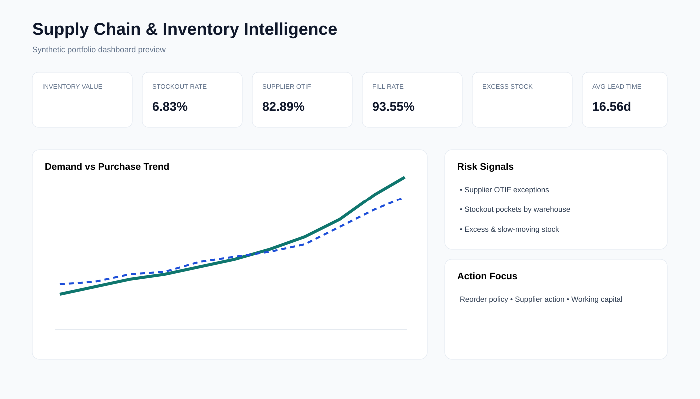
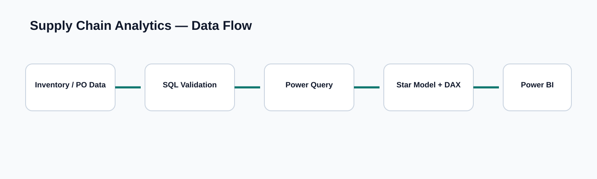

# Supply Chain & Inventory Intelligence

Recruiter-ready **Power BI + SQL + Power Query + DAX** portfolio project using a fully synthetic inventory and replenishment dataset.

> **Synthetic portfolio dataset — created for demonstration purposes. No employer or confidential data is used.**



## Business Problem
A multi-warehouse retailer wants to reduce stock-outs, excess inventory, supplier delays, backorders and working capital tied up in slow-moving stock.

## Project Scale
- 36,000 synthetic inventory/replenishment observations
- 24 months: 2024–2025
- 60 products / 6 categories
- 8 warehouses across India
- 10 suppliers
- Q4 demand seasonality and deliberately engineered supplier/warehouse risk patterns

## Validated Portfolio KPIs
- Stockout Rate: **6.83%**
- Supplier OTIF: **82.89%**
- Fill Rate: **93.55%**
- Average Lead Time: **16.56 days**
- Highest stockout-risk warehouse: **Kolkata DC**
- Weakest supplier by OTIF: **EastBridge Manufacturing**
- Highest excess-stock category: **Office**

## Core KPIs
Inventory Value, Stockout Rate %, Supplier OTIF %, Fill Rate %, Excess Stock Value, Average Lead Time, Days of Inventory, Slow-Moving Rate %, Backorder Qty, Reorder Risk.

## Architecture


## Repository Structure
- `scripts/` — reproducible synthetic data generator
- `data/` — representative sample data
- `sql/` — schema and validation queries
- `power_query/` — Power Query M
- `dax/` — semantic measures
- `powerbi/` — dashboard build specification and theme
- `docs/` — BRD, model, dictionary, insights and interview walkthrough
- `assets/` — recruiter-facing dashboard and architecture visuals

## Reproduce Data
```bash
pip install -r requirements.txt
python scripts/generate_data.py
```

## Report Pages
1. Inventory Executive Overview
2. Stock Health & Working Capital
3. Supplier Performance
4. Demand, Replenishment & Risk

## Portfolio Story
**Business problem → inventory policy → synthetic data → SQL validation → Power Query → star schema → DAX → dashboard → operational insights → recommendations.**

## Author
**Sriram Selvam** — Data / BI / Business Analysis Portfolio
